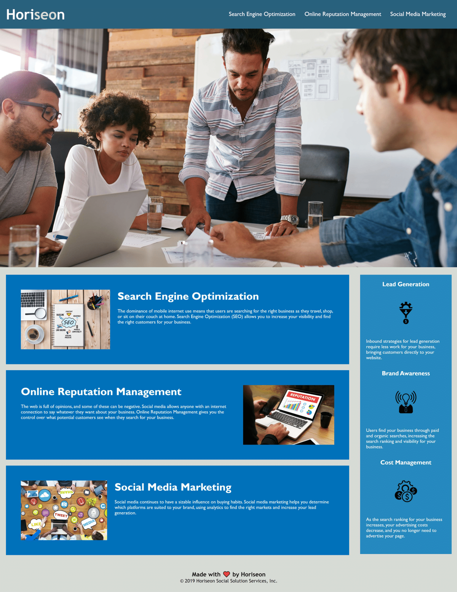

# 1-30-21-Homework
# 01 HTML CSS Git: Code Refactor

The Horiseon webpage now has a title, sequential headers, semantic HTML elements, and image alt attributes. The goal of these additions is to increase both the page's accessibility for users on e-readers and position in search engines. A broken nav link was also fixed ("Search Engine Optimization"). The CSS for the webpage has been consolidated and restructured so as to follow the semantic structure of the HTML.

You can view the new page [here](https://elisesamanthadaly.github.io/1-30-21-Homework/).

## Usage

Just click one of the three links at the top right of the page to be brought down to the appropriate section (see image below).

## Credits

Where would any of us be without [w3schools](https://www.w3schools.com/)...

## License

MIT License

Copyright (c) 2021 Elise Daly

Permission is hereby granted, free of charge, to any person obtaining a copy
of this software and associated documentation files (the "Software"), to deal
in the Software without restriction, including without limitation the rights
to use, copy, modify, merge, publish, distribute, sublicense, and/or sell
copies of the Software, and to permit persons to whom the Software is
furnished to do so, subject to the following conditions:

The above copyright notice and this permission notice shall be included in all
copies or substantial portions of the Software.

THE SOFTWARE IS PROVIDED "AS IS", WITHOUT WARRANTY OF ANY KIND, EXPRESS OR
IMPLIED, INCLUDING BUT NOT LIMITED TO THE WARRANTIES OF MERCHANTABILITY,
FITNESS FOR A PARTICULAR PURPOSE AND NONINFRINGEMENT. IN NO EVENT SHALL THE
AUTHORS OR COPYRIGHT HOLDERS BE LIABLE FOR ANY CLAIM, DAMAGES OR OTHER
LIABILITY, WHETHER IN AN ACTION OF CONTRACT, TORT OR OTHERWISE, ARISING FROM,
OUT OF OR IN CONNECTION WITH THE SOFTWARE OR THE USE OR OTHER DEALINGS IN THE
SOFTWARE.